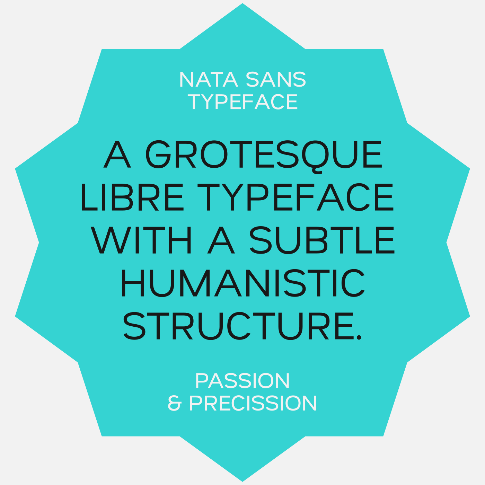

# Nata Sans

**Nata Sans** is a grotesque typeface with a subtle humanist structure.

Originally designed for user interfaces, it features a generous x-height that gives it a slightly *display* feel. Its wide glyphs promote relaxed, slow, and clear reading — ideal for interfaces, editorial design, or signage.

With short ascenders and descenders, Nata Sans offers a compact yet balanced texture on the page. The distinctive curvature of letters like “o” and “a” forms the core of its visual identity.

 
👉 [Web specimen](https://dnlzqn.xyz/nata)

---

## ✨ Version 2.0 Highlights

This release marks the completion of **version 2.0**, fully prepared for inclusion in the Google Fonts library.

### 🔤 Language & Script Support
- 100% **Latin Plus** coverage: supports **219 Latin-based languages** used in 212 countries
- Full **Cyrillic** and **Cyrillic Extended** support
- **Vietnamese** support

### 🎚 Font Technology
- Variable font with one axis: `wght` (100–900)
- 9 predefined instances:  
  Thin, ExtraLight, Light, Regular, Medium, SemiBold, Bold, ExtraBold, Black
- 1022 glyphs drawn across 4 interpolation masters
- 18 OpenType features:  
  `calt`, `liga`, `ss01`, `locl`, `frac`, `tnum`, `onum`, `sups`, and more

### 😄 Emoji Ligatures (Markdown-style)
Type words between colons — like `:smile:` or `:wink:` — and they will automatically turn into expressive ligature glyphs.

Ideal for subversive headlines, UI elements, or typographic play.

**Supported sequences:**
- `:smile:` → 😄
- `:wink:` → 😉
- `:sad:` → 😢
- `:cry:` → 😭
- `:laugh:` → 😂
- `:angry:` → 😠
- `:surprised:` → 😲
- `:eyeroll:` → 🙄
- `:tongue:` → 😛

---

## 📦 Files Included

- `NataSans[wght].ttf` (variable font)
- `OFL.txt`
- `metadata.json` (includes meta table: `dlng`, `slng`)
- `DESCRIPTION.en_us.html`
- `article.md`

---

## 📄 License

**Nata Sans** is released under the [SIL Open Font License (OFL)](https://scripts.sil.org/OFL).

You’re free to use, modify, and distribute it for personal or commercial projects.  
You may not sell it on its own or apply additional restrictions.  
The license must always be included with the font.

---

## 👤 Author

Designed and developed by [Daniel Uzquiano](https://www.dnlzqn.xyz)  
Contact: [daniel.uzquiano@gmail.com](mailto:daniel.uzquiano@gmail.com)

Nata Sans was developed using [GlyphsApp](https://glyphsapp.com).  
Actively maintained at: [github.com/dnlzqn/nata-sans](https://github.com/dnlzqn/nata-sans)

---

> Thank you to everyone who supported this release and helped test and refine the typeface.
