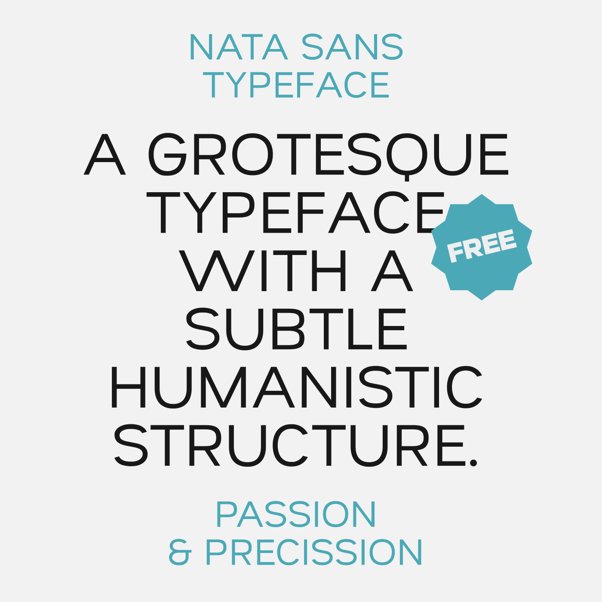

# About Nata Sans

**Nata Sans is a grotesque typeface with a subtle humanistic structure.**

Designed for user interfaces, it features a generous x-height that introduces a slightly display-oriented tone. Its wide glyphs promote a relaxed and clear reading rhythm, especially suitable for screen use.

With short ascenders and descenders, Nata Sans conveys a restrained and efficient personality. It stands as a fresh and versatile alternative to Helvetica. The rounded forms of the letters “o” and “a” encapsulate the family’s distinctive DNA.

This font family is fully compliant with the Latin Plus character set, covering 219 Latin-based languages spoken across 212 countries.

Nata Sans is a variable font with six predefined weights ranging from Thin to Black. The font contains 1056 glyphs, each drawn across four masters to ensure smooth and accurate interpolation throughout the weight axis.

## License

**Nata Sans is released under the SIL Open Font License (OFL).**

This license allows you to freely use, modify, and distribute the font for personal and commercial purposes, provided it is not sold as a standalone product. The license must always accompany the font and no additional restrictions may be applied.

## Author

Created by [Daniel Uzquiano](https://www.dnlzqn.xyz/)  
Contact: [daniel.uzquiano@gmail.com](mailto:daniel.uzquiano@gmail.com)

Nata Sans was developed using GlyphsApp.
